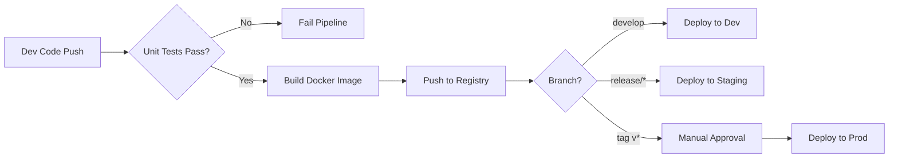

# CI/CD Pipeline & Infrastructure Documentation

## 1. Infrastructure Setup Guide

### Overview
This guide covers the provisioning of Ubuntu VMs for Development, Staging, and Production environments, hosting a Kubernetes-based microservices architecture.

### Environment Specifications
| Environment | Role | Min Specs | OS |
|-------------|------|-----------|----|
| **Development** | Feature testing, daily builds | 2 vCPU, 4GB RAM, 20GB Disk | Ubuntu 22.04 LTS |
| **Staging** | Pre-release integration, UAT | 2 vCPU, 8GB RAM, 40GB Disk | Ubuntu 22.04 LTS |
| **Production** | Live traffic | 4 vCPU, 16GB RAM, 80GB Disk | Ubuntu 22.04 LTS |

### Step-by-Step Provisioning

#### 1. Initial System Configuration
Perform these steps on all nodes as `root`.

```bash
# Update system
apt update && apt upgrade -y

# Create a non-root user with sudo access
adduser deployer
usermod -aG sudo deployer

# Setup SSH hardening
sed -i 's/PermitRootLogin yes/PermitRootLogin no/' /etc/ssh/sshd_config
sed -i 's/PasswordAuthentication yes/PasswordAuthentication no/' /etc/ssh/sshd_config
systemctl restart sshd
```

#### 2. Network Security (UFW)
Configure the firewall to allow only necessary traffic.

```bash
ufw default deny incoming
ufw default allow outgoing
ufw allow 22/tcp          # SSH
ufw allow 80/tcp          # HTTP
ufw allow 443/tcp         # HTTPS
ufw allow 16443/tcp       # K8s API (Restrict source IP in production)
ufw enable
```

#### 3. Install Dependencies
Install Docker and MicroK8s (lightweight Kubernetes).

```bash
# Install Docker
apt install -y docker.io
usermod -aG docker deployer

# Install MicroK8s
snap install microk8s --classic --channel=1.28/stable
usermod -aG microk8s deployer
microk8s status --wait-ready

# Enable standard plugins
microk8s enable dns ingress storage dashboard
```

---

## 2. CI/CD Pipeline Design

### Workflow Overview
We utilize **GitHub Actions** for Continuous Integration (CI) and Continuous Deployment (CD). The pipeline follows a GitFlow-inspired branching strategy.

### Branching Strategy
*   **`feature/*`**: Developer workspaces. CI runs Unit Tests.
*   **`develop`**: Integration branch. CI builds images -> Deploys to **Dev** Cluster.
*   **`release/*`**: Release candidates. CI builds images -> Deploys to **Staging** Cluster.
*   **`main`**: Production code. Triggered by **Tags (v*)**. Deploys to **Production** after manual approval.

### Pipeline Stages
1.  **Code Push**: Developer pushes code to GitHub.
2.  **CI (Build & Test)**:
    *   Checkout Code.
    *   Linting (ESLint, Flake8).
    *   Unit Testing (Jest, PyTest).
    *   Build Docker Images.
    *   Scan for Vulnerabilities (Trivy).
    *   Push to Container Registry (GHCR/DockerHub).
3.  **CD (Deploy)**:
    *   Authenticate with K8s Cluster (via Kubeconfig).
    *   Update Manifests with new Image Tag.
    *   Apply manifests (`kubectl apply`).
    *   Verify Rollout (`kubectl rollout status`).

---

## 3. Implementation Details

### 1. Source Code Management (GitHub)
*   **Branch Protection**:
    *   Require status checks to pass before merging.
    *   Require 1 reviewer for `develop` and `main`.

### 2. Build Automation (GitHub Actions)
Create `.github/workflows/ci-cd.yaml`:

```yaml
name: CI/CD Pipeline

on:
  push:
    branches: [ develop, main ]
    tags: [ 'v*' ]
  pull_request:
    branches: [ develop ]

env:
  REGISTRY: ghcr.io
  IMAGE_NAME: ${{ github.repository }}

jobs:
  test:
    runs-on: ubuntu-latest
    steps:
      - uses: actions/checkout@v3
      - name: Run Tests
        run: |
          # Add commands to run backend/frontend tests
          echo "Running tests..."

  build-and-push:
    needs: test
    if: github.event_name != 'pull_request'
    runs-on: ubuntu-latest
    permissions:
      contents: read
      packages: write
    steps:
      - uses: actions/checkout@v3
      - name: Log in to Registry
        uses: docker/login-action@v2
        with:
          registry: ${{ env.REGISTRY }}
          username: ${{ github.actor }}
          password: ${{ secrets.GITHUB_TOKEN }}
      
      - name: Build and Push Docker image
        uses: docker/build-push-action@v4
        with:
          context: .
          push: true
          tags: ${{ env.REGISTRY }}/${{ env.IMAGE_NAME }}:${{ github.sha }}

  deploy:
    needs: build-and-push
    runs-on: ubuntu-latest
    steps:
      - name: Set Kubeconfig
        uses: azure/k8s-set-context@v3
        with:
          method: kubeconfig
          kubeconfig: ${{ secrets.KUBECONFIG }}
      
      - name: Deploy to Cluster
        run: |
          # Update image tag in deployment.yaml
          cd infra/k8s/backend
          kustomize edit set image backend=${{ env.REGISTRY }}/${{ env.IMAGE_NAME }}:${{ github.sha }}
          kubectl apply -k .
          kubectl rollout status deployment/backend -n app
```

### 3. Required Tools Installation
On the CI runner (or local machine for setup):

```bash
# Install Kustomize
curl -s "https://raw.githubusercontent.com/kubernetes-sigs/kustomize/master/hack/install_kustomize.sh"  | bash
sudo mv kustomize /usr/local/bin/

# Install Kubectl
sudo snap install kubectl --classic
```

---

## 4. Operational Procedures

### Daily Maintenance
*   **Monitoring**: Check `microk8s kubectl get nodes` and `microk8s kubectl top pods -n app`.
*   **Log Rotation**: Ensure `/var/log` doesn't fill up. Configure `logrotate`.

### Backup & Recovery
*   **Database Backup**:
    ```bash
    # Run inside VM
    kubectl exec -n app statefulset/postgres -- pg_dump -U user dbname > /backup/db_$(date +%F).sql
    # Sync to S3
    aws s3 cp /backup/db_*.sql s3://my-backup-bucket/
    ```
*   **Cluster Restore**:
    If a node fails, re-provision a new VM and re-run the "Infrastructure Setup" steps, then re-apply manifests from Git.

### Security Best Practices
*   **Secret Management**: Never commit secrets to Git. Use GitHub Secrets for CI/CD and Kubernetes Secrets (sealed-secrets or manual creation) for runtime.
*   **Updates**:
    ```bash
    sudo apt update && sudo apt upgrade -y
    sudo snap refresh microk8s
    ```

---

## 5. Workflow Documentation

### Pipeline Visual Flow


### Role-Based Access Control (RBAC)
*   **Developers**:
    *   Git: Read/Write to `feature/*`, Pull Requests.
    *   K8s: Read-only access to Dev namespace logs.
*   **DevOps/Admins**:
    *   Git: Merge to `main`, Manage Secrets.
    *   K8s: Cluster Admin.

---

## 6. Command Reference

### Infrastructure Management
| Action | Command |
|--------|---------|
| SSH into Node | `ssh deployer@<ip-address>` |
| Check Firewall | `sudo ufw status` |
| System Logs | `journalctl -xe` |

### Kubernetes Operations
| Action | Command |
|--------|---------|
| Get All Pods | `microk8s kubectl get pods -A` |
| Pod Logs | `microk8s kubectl logs -f <pod-name> -n app` |
| Restart Deployment | `microk8s kubectl rollout restart deployment/backend -n app` |
| Cluster Info | `microk8s cluster-info` |

### Pipeline Execution
| Action | Command |
|--------|---------|
| Trigger Manual Workflow | `gh workflow run deploy.yaml` |
| View Run Status | `gh run list` |
| Create Release Tag | `git tag v1.0.0 && git push origin v1.0.0` |
